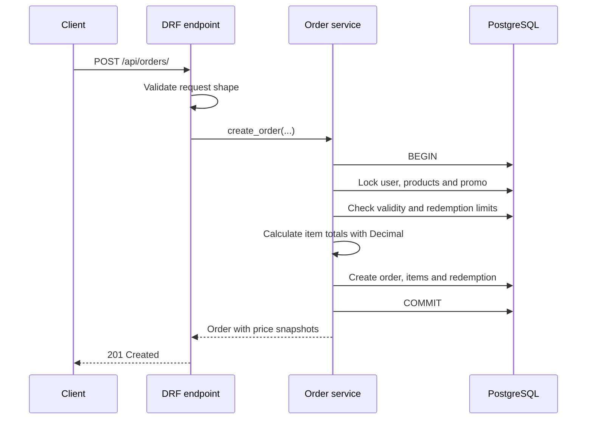

<div align="center">

# Django Promo Orders

**A transaction-safe REST API for creating orders and redeeming percentage promo codes.**

[](https://github.com/IgorNadein/django-promo-orders/actions/workflows/ci.yml)
[](https://www.python.org/)
[](https://www.djangoproject.com/)
[](https://www.django-rest-framework.org/)
[](LICENSE)

</div>

The service implements the complete order creation flow: it validates the request,
captures immutable price snapshots, calculates discounts with `Decimal`, and
atomically reserves a promo redemption. PostgreSQL row locking and database
constraints protect the business rules under concurrent requests.

## At a glance

| Area | Implementation |
|---|---|
| API | Django REST Framework, `POST /api/orders/` |
| Data | PostgreSQL in Docker; SQLite for zero-configuration local use |
| Consistency | `transaction.atomic()`, `select_for_update()`, database constraints |
| Money | `Decimal`, explicit cent rounding, historical price snapshots |
| Quality | 16 tests, Ruff, mypy, Django system checks, GitHub Actions |
| Runtime | Docker Compose, PostgreSQL 17, Gunicorn |

## Business rules

- The promo code must exist, be enabled, and be inside its validity window.
- The global redemption limit must not be exhausted.
- A user can redeem a promo code only once.
- A category-limited promo discounts matching products only.
- Products excluded from promotions always retain their full price.
- A supplied promo must apply to at least one item.
- Duplicate product lines and invalid quantities are rejected.

## Request flow



## Quick start

### SQLite

Python 3.10 or newer and [uv](https://docs.astral.sh/uv/) are required.

```bash
uv sync --dev
uv run python manage.py migrate
uv run python manage.py seed_demo
uv run python manage.py runserver
```

The endpoint is available at `http://127.0.0.1:8000/api/orders/`.

### PostgreSQL and Docker

```bash
docker compose up --build --wait
docker compose exec web python manage.py seed_demo
```

The container is exposed at `http://127.0.0.1:8015` by default. Set
`APP_PORT=8000` or another free port to override it.

## API example

```bash
curl -X POST http://127.0.0.1:8000/api/orders/ \
  -H 'Content-Type: application/json' \
  -d '{
    "user_id": 1,
    "goods": [{"good_id": 1, "quantity": 2}],
    "promo_code": "SUMMER2025"
  }'
```

```json
{
  "user_id": 1,
  "order_id": 1,
  "goods": [
    {
      "good_id": 1,
      "quantity": 2,
      "price": 100,
      "discount": "0.1",
      "total": 180
    }
  ],
  "price": 200,
  "discount": "0.1",
  "total": 180
}
```

Omit `promo_code` to create an order without a discount.

## Architecture

```text
config/                  Django settings and URL configuration
orders/
├── models.py            Domain entities and database constraints
├── serializers.py       Request validation and response contract
├── services.py          Transactional order creation use case
├── views.py             Thin HTTP adapter
├── admin.py             Readable operational interface
├── management/commands/ Deterministic demo data
└── tests/                API and model validation scenarios
```

The view handles HTTP concerns, serializers validate the external contract, and the
service owns the transaction and business operation. Models preserve historical
order values and enforce invariants that must hold regardless of the caller.

## Consistency under concurrency

Order creation runs inside `transaction.atomic()`. The promo row is selected with
`select_for_update()` before the current redemption count is checked. Requests
competing for the last available redemption therefore serialize on PostgreSQL.

A unique `(promo_code, user)` constraint provides a second line of defense against
repeated redemption. Product values are also read under a lock and copied into
`OrderItem`, so an order retains the exact name, price and discount used at creation.

SQLite is convenient for a quick local check, but PostgreSQL should be used when
evaluating row-level locking behavior.

## Discount behavior

| Product | Promo scope | Applied rate |
|---|---|---:|
| Promotions allowed | All categories | Promo rate |
| Promotions allowed | Matching category | Promo rate |
| Promotions allowed | Different category | `0` |
| Promotions excluded | Any promo | `0` |

For mixed orders, the response exposes the promo rate at order level and the actual
applied rate for each item. If every item is ineligible, the promo is rejected.

## Error contract

Business validation failures return HTTP 400 with a stable code suitable for a
frontend or API client:

```json
{
  "promo_code": [
    {
      "message": "Срок действия промокода истёк.",
      "code": "promo_expired"
    }
  ]
}
```

Other promo error codes cover missing, inactive, future, exhausted, previously used
and inapplicable codes. User, product and request-shape errors use the same field-led
response style.

## Quality checks

```bash
make check
```

This runs:

```bash
uv run ruff check .
uv run ruff format --check .
uv run mypy config orders
uv run pytest
```

GitHub Actions executes the same checks on Python 3.10 and 3.12.

## Assumptions

- Authentication is outside the task scope, so the request accepts `user_id`.
- One order may contain at most 100 distinct product lines.
- Percentage values are whole numbers from 1 through 100 and are returned as rates.
- Inventory reservation and payment processing are outside this endpoint.

## License

Distributed under the [MIT License](LICENSE).
