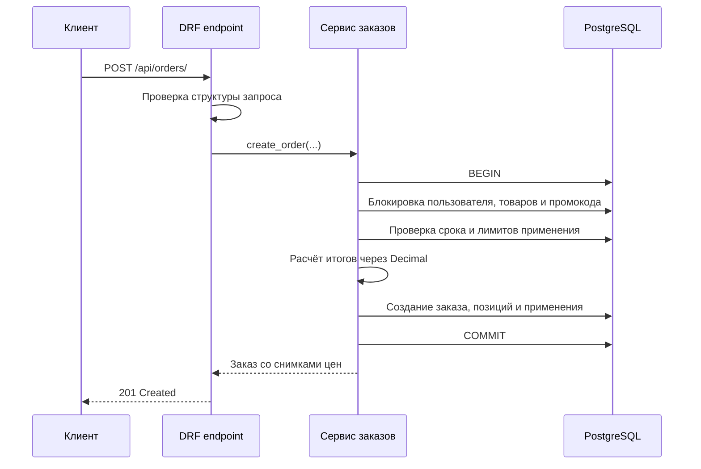

<div align="center">

# Django Promo Orders

**REST API для создания заказов и безопасного применения процентных промокодов.**

[English](README.md) · **Русский**

[](https://github.com/IgorNadein/django-promo-orders/actions/workflows/ci.yml)
[](https://github.com/IgorNadein/django-promo-orders/releases)
[](https://www.python.org/)
[](https://www.djangoproject.com/)
[](https://www.django-rest-framework.org/)
[](LICENSE)

</div>

Сервис реализует полный сценарий создания заказа: проверяет запрос, сохраняет
неизменяемые снимки цен, рассчитывает скидки через `Decimal` и атомарно фиксирует
применение промокода. Блокировка строк PostgreSQL и ограничения базы данных
защищают бизнес-правила при конкурентных запросах.

## Краткий обзор

| Область | Реализация |
|---|---|
| API | Django REST Framework, `POST /api/orders/` |
| Данные | PostgreSQL в Docker; SQLite для локального запуска без настройки |
| Согласованность | `transaction.atomic()`, `select_for_update()`, ограничения БД |
| Деньги | `Decimal`, явное округление до копеек, исторические снимки цен |
| Качество | 26 тестов на PostgreSQL, Ruff, mypy, Django system checks, GitHub Actions |
| Запуск | Docker Compose, PostgreSQL 17, Gunicorn |

## Бизнес-правила

- Промокод должен существовать, быть активным и находиться в периоде действия.
- Общий лимит применений не должен быть исчерпан.
- Один пользователь может применить промокод только один раз.
- Промокод с ограничением по категории применяется только к подходящим товарам.
- Товары, исключённые из акций, всегда сохраняют полную цену.
- Указанный промокод должен применяться хотя бы к одному товару.
- Повторяющиеся строки товара и некорректное количество отклоняются.

## Обработка запроса



## Быстрый запуск

### SQLite

Требуются Python 3.10 или новее и [uv](https://docs.astral.sh/uv/).

```bash
uv sync --dev --locked
uv run python manage.py migrate
uv run python manage.py seed_demo
uv run python manage.py runserver
```

Endpoint будет доступен по адресу `http://127.0.0.1:8000/api/orders/`.

### PostgreSQL и Docker

```bash
docker compose up --build --wait
docker compose exec web python manage.py seed_demo
```

По умолчанию контейнер доступен по адресу `http://127.0.0.1:8015`. Для изменения
порта задайте `APP_PORT=8000` или другой свободный порт.

## Пример API

```bash
curl -X POST http://127.0.0.1:8000/api/orders/ \
  -H 'Content-Type: application/json' \
  -d '{
    "user_id": 1,
    "goods": [{"good_id": 1, "quantity": 2}],
    "promo_code": "SUMMER2025"
  }'
```

```json
{
  "user_id": 1,
  "order_id": 1,
  "goods": [
    {
      "good_id": 1,
      "quantity": 2,
      "price": 100,
      "discount": "0.1",
      "total": 180
    }
  ],
  "price": 200,
  "discount": "0.1",
  "total": 180
}
```

Для создания заказа без скидки поле `promo_code` нужно пропустить.

## Архитектура

```text
config/                  Настройки Django и маршрутизация
orders/
├── models.py            Доменные сущности и ограничения БД
├── serializers.py       Валидация запроса и контракт ответа
├── services.py          Транзакционный сценарий создания заказа
├── views.py             Тонкий HTTP-адаптер
├── admin.py             Операционный интерфейс Django Admin
├── management/commands/ Детерминированные демонстрационные данные
└── tests/                Проверки API и валидации моделей
```

View отвечает за HTTP, serializers проверяют внешний контракт, а service содержит
транзакцию и бизнес-операцию. Модели сохраняют исторические значения заказа и
обеспечивают инварианты, которые должны выполняться для любого вызывающего кода.

## Согласованность при конкурентных запросах

Создание заказа выполняется внутри `transaction.atomic()`. Перед проверкой числа
применений строка промокода выбирается через `select_for_update()`. Поэтому запросы,
конкурирующие за последнее доступное применение, выполняются последовательно в
PostgreSQL.

Уникальное ограничение `(promo_code, user)` дополнительно защищает от повторного
применения одним пользователем. Товары также читаются под блокировкой, а их название,
цена и скидка копируются в `OrderItem`, поэтому история заказа не меняется вместе с
каталогом.

SQLite удобна для быстрой локальной проверки. Для проверки блокировок строк следует
использовать PostgreSQL.

## Правила расчёта скидки

| Товар | Область действия промокода | Применённая ставка |
|---|---|---:|
| Участвует в акциях | Все категории | Ставка промокода |
| Участвует в акциях | Совпадающая категория | Ставка промокода |
| Участвует в акциях | Другая категория | `0` |
| Исключён из акций | Любой промокод | `0` |

Для смешанного заказа ответ содержит ставку промокода на уровне заказа и фактически
применённую ставку в каждой позиции. Если ни один товар не подходит, промокод
отклоняется.

## Формат ошибок

Ошибки бизнес-валидации возвращаются с HTTP 400 и стабильным кодом для интерфейса
или API-клиента:

```json
{
  "promo_code": [
    {
      "message": "Срок действия промокода истёк.",
      "code": "promo_expired"
    }
  ]
}
```

Отдельные коды предусмотрены для отсутствующего, отключённого, ещё не начавшего
действовать, исчерпанного, уже использованного и неприменимого промокода. Ошибки
пользователя, товара и структуры запроса используют такой же формат с указанием поля.

## Проверки качества

```bash
make check
```

Команда выполняет:

```bash
uv run ruff check .
uv run ruff format --check .
uv run mypy config orders
uv run pytest
```

GitHub Actions выполняет проверки на Python 3.10 и 3.12 с SQLite и полный набор тестов на PostgreSQL 17. Три теста с независимыми соединениями и настоящими транзакциями проверяют последнее применение промокода, повторное применение одним пользователем и пересекающиеся блокировки товаров. На SQLite они явно пропускаются. `make check` также запускает системные проверки Django и проверку актуальности миграций.

## Числовые границы и транзакции

Денежные значения округляются для каждой позиции через `ROUND_HALF_UP`; итог заказа
складывается из округлённых итогов позиций. Округление каждой единицы товара не применяется.
Сумма до скидки выше `999999999999.99` возвращает HTTP 400 с кодом
`order_total_too_large` до сохранения заказа, позиций и использования промокода.
Слишком большие ID пользователя и товара отклоняются валидацией. Неожиданный сбой
записи в базу откатывает всю операцию.

Товары блокируются в порядке первичного ключа, чтобы пересекающиеся корзины не
захватывали их в противоположном порядке. SQLite остаётся вариантом локальной разработки;
конкурентная запись и поведение блокировок проверяются на PostgreSQL.

Полный набор тестов на отдельном экземпляре PostgreSQL:

```bash
POSTGRES_HOST=127.0.0.1 POSTGRES_PORT=5432 POSTGRES_DB=promo_orders \
POSTGRES_USER=promo_orders POSTGRES_PASSWORD=promo_orders uv run pytest
```

Роли базы нужно право создать временную тестовую БД.

## Допущения

- Аутентификация не входит в условие, поэтому запрос явно принимает `user_id`.
- Один заказ может содержать не более 100 различных товарных строк.
- Процент скидки задаётся целым числом от 1 до 100, а возвращается как ставка.
- Резервирование остатков и проведение платежа не входят в этот endpoint.

## Лицензия

Проект распространяется по [лицензии MIT](LICENSE).
